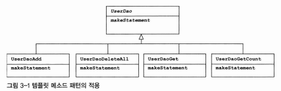

# Vol. 1 3장 템플릿

확장에는 자유롭게 열려 있고 변경에는 굳게 닫혀 있다는 객체지향 설계의 핵심 원칙인 **개방 폐쇄 원칙(OCP)**

⇒ 코드에서 어떤 부분은 변경을 통해 그 기능이 다양해지고 확장하려는 성질이 있고, 어떤 부분은 고정되어 있고 변하지 않으려는 성질이 있다.

## 3.1 다시 보는 초난감 DAO

DB 연결과 관련된 여러 가지 개선 작업은 했지만, 다른 면에서 심각한 문제점이 있다.

**⇒ 예외사항에 대한 처리**

### 3.1.1 예외처리 기능을 갖춘 DAO

**🚫 JDBC 수정 기능의 예외처리 코드**

```jsx
public void deleteAll() throws SQLException {
    Connection c = dataSource.getConnection();

    PreparedStatement ps = c.preparedStatement("delete from users");
    ps.executeUpdate();     //  여기서 예외가 발생하면 바로 메소드 실행이 중단되면서 DB 커넥션이 반환되지 못한다.

    ps.close();
    c.close();
}
```

- DB 풀은 매번 getConnection()으로 가져간 커넥션을 명시적으로 close()해서 돌려줘야지만
- 다시 풀에 넣었다가 다음 커넥션 요청이 있을 때 재사용할 수 있다.
- 그런데 이런 식으로 오류가 날 때마다 미처 반환되지 못한 Connection이 계속 쌓이면
- 커넥션 풀에 여유가 없어지고 리소스가 모자란다는 심각한 오류를 내며 서버가 중단될 수 있다.

> **리소스 반환과 close()**
> Connection 이나 PreparedStatement에는 close() 메소드가 있다.
> 열린 것을 닫는다, 리소스를 반환한다는 의미.

보통 풀(poll) 방식으로 운영됨
⇒ 미리 정해진 풀 안에서 제한된 수의 리소스를 만들어두고 필요할 때 할당하고 반환하면 다시 풀에 넣는 방식으로 운영

close() 메소드

- 사용한 리소스를 풀로 다시 돌려주는 역할
  >

**예외사항에서도 리소스를 제대로 반환할 수 있도록**

**try/catch/finally를 적용해보자**

```jsx
public void deleteAll() throws SQLException {
    Connection c = null;
    PreparedStatement ps = null;

    try {
        c = dataSource.getConnection();
        ps = c.prepareStatement("delete from users");
        ps.executeUpdate();     //  예외가 발생할 수 있는 코드를 모두 try 블록으로 묶어준다.
    } catch (SQLException e) {
        throw e;        //  예외가 발생했을 때 부가적인 작업을 해줄 수 있도록 catch 블록을 둔다. 아직은 예외를 메소드 밖으로 던지는 것 밖에 없다.
    } finally {         //  finally이므로 try 블록에서 예외가 발생했을 떄나 안 했을 때나 모두 실행된다.
        if (ps != null) {
            try {
                ps.close();
            } catch (SQLException e) {} //  ps.close() 메소드에서도 SQLException이 밣생할 수 있기 때문에 잡아줘야한다.
        }
        if (c != null) {
            try {
                c.close();
            } catch (SQLException e) {}
        }
    }
}
```

- 어느 시점에서 예외가 발생했는지에 따라서 close()를 사용할 수 있는 변수가 달라질 수 있기 때문에
- finally에서는 반드시 c와 ps가 null이 아닌지 먼저 확인한 후에 close() 메소드를 호출해야 한다.
- 문제는 이 close()도 SQLException이 발생할 수 있는 메소드라는 점이다.

**JDBC 조회 기능의 예외처리**

- Connection, PreparedStatement + ResultSet
- 예외상황에서도 ResultSet의 close() 메소드가 반드시 호출되어야 함

```jsx
public int getCountO throws SQLException {
		Connection c = null；
		PreparedStatement ps = null；
		ResultSet rs = null；

		try {
				c = dataSource.getConnectionO；
				ps = c.prepareStatement("select count(*) from users")；

				rs = ps.executeQueryO；
				rs.next();
				return rs.getlnt(1 )；

				// ResultSet도 다양한 SQLException이 발생할 수 있는
				// 코드이므로 try 블록 안에 둬야 한다.

				} catch (SQLException e) {
						throw e；
				} finally {
						if (rs != null) {
								try {
										rs.closeO；
								} catch (SQLException e) {
								}
								// 만들어진 ResultSet을 닫아주는 기능. close()는
								// 만들어진 순서의 반대로 하는 것이 원칙이다.
						}
						if (ps != null) {
								try {
										ps.closeO；
								} catch (SQLException e) {
								}
						}
						if (c != null) {
								try {
										c.closeO；
								} catch (SQLException e) {
								}
						}
				}
		}
}
```

## 3.2 변하는 것과 변하지 않는 것

### 3.2.1 JDBC try/catch/finally 코드의 문제점

현재 문제점

- BUT 복잡한 try/catch/finally 블록은 2중으로 중첩되어 있고 모든 메소드마다 반복
- 반복 작업을 하다가 어느 순간 한 줄을 빼먹고 복사했거나, 몇 줄을 잘못 삭제했다면?
  - 해당 메소드가 호출되고 나면 커넥션이 하나씩 반환되지 않고 쌓여가게 된다.
- DAO 로직을 개선하려고 해도 중복된 모든 부분을 찾아서 수정해야 하고 어느 한 곳이라도 못 찾을경우에는 심각한 오류를 발생할 수 있음
- 테스트도 예외상황을 처리하는 코드는 테스트하기가 매우 어려움
- 모든 DAO 메소드에 대해 이런 테스트를 일일이 한다는 건 매우 번거로움

이 문제의 핵심은 **변하지 않는, 그러나 많은 곳에서 중복되는 코드와 로직에 따라 자꾸 확장되고 자주 변하는 코드를 잘 분리해내는 작업**이다.

### 3.2.2 분리와 재사용을 위한 디자인 패턴 적용

**메소드 추출**

```jsx
public void deleteAll() throws SQLException {
    ...
    try {
        c = dataSource.getConnectin();
        ps = makeStatement(c);      //  변하는 부분을 메소드로 추출하고 변하지 않는 부분에서 호출한다.
        ps.executeUpdate();
    } catch (SQLException e) {...}
}

private PreparedStatement makeStatement(Connection c) throws SQLException {
    PreparedStatement ps;
    ps = c.preparedStatement("delete from users");
    return ps;
}
```

- 보통 메소드 추출 리팩토링을 적용하는 경우에는 분리시킨 메소드를 다른 곳에서 재사용할 수 있어야 하는데,
- 이건 반대로 분리시키고 남은 메소드가 재사용이 필요한 부분이고,
- 분리된 메소드는 DAO 로직마다 새롭게 만들어서 확장돼야 하는 부분이기 때문에
- 뭔가 반대로 되었다?

**템플릿 메소드 패턴의 적용**

> **🔔 템플릿 메소드 패턴**

- 상속을 통해 기능을 확장해서 사용하는 부분
  - 변하지 않는 부분 - 슈퍼클래스에 두고
  - 변하는 부분 - 추상 메소드
- 서브클래스에서 오버라이드하여 새롭게 정의해 쓰도록 하는 것

```jsx
public class UserDaoDeleteAll extends UserDao {
    protected PreparedStatement makeStatement(Connection c) throws SQLException {
        PreparedStatement ps = c.preparedStatement("delete from users");
        return ps;
    }
}
```

- UserDao 클래스의 기능을 확장하고 싶을 때마다 상속을 통해 자유롭게 확장 할 수 있음
- 확장 때문에 기존의 상위 DAO 클래스에 불필요한 변화는 생기지 않음
- ⇒ 개방 폐쇄 원칙(OCP)을 그럭저럭 지키는 구조
- BUT 템플릿 메소드 패턴으로의 접근은 제한이 多



**전략 패턴의 적용**

> **📣 전략 패턴**

- 템플릿 메소드 패턴보다 유연하고 확장성이 뛰어남
- 오브젝트를 아예 둘로 분리
- 클래스 레벨에서는 인터페이스를 통해서만 의존하도록 만드는 패턴


- 전략 패턴의 구조를 따라 이 기능을 인터페이스로 만들어두고
- 인터페이스의 메소드를 통해 PreparedStatement 생성 전략을 호출해주면 됨

```jsx
public void deleteAll() throws SQLException {
    ...
    try {
        c = dataSource.getConnection();

        StatementStrategy strategy = new DeleteAllStatement();  //  전략 클래스가 DeleteAllStatement로 고정됨으로써 OCP 개방 원칙에 맞지 않게 된다.
        ps = starategy.makePreparedStatement(c);

        ps.executeUpdate();
    } catch (SQLException e) {...}
}
```

- 전략 패턴은 필요에 따라 컨텍스트는 그대로 유지되면서 전략을 바꿔 쓸 수 있다는 것인데,
- BUT 이렇게 컨텍스트 안에서 이미 구체적인 전략 클래스인 DeleteAllStatement를 사용하도록 고정되어 있다면 뭔가 이상하다?

**DI 적용을 위한 클라이언트 / 컨텍스트 분리**

- 전략 패턴에 따르면 Context가 어떤 전략을 사용하게 할 것인가는 Context를 사용하는 앞단의 Client가 결정하는 게 일반적


📍 컨텍스트에 해당하는 JDBC try/catch/finally 코드를 클라이언트 코드인 StatementStrategy를 만드는 부분에서 독립시켜야 한다는 점

```jsx
public void jdbcContextWithStatementStrategy(StatementStrategy stmt) throws SQLException {
    Connection c = null;
    PreparedStatement ps = null;

    try {
        c = dataSource.getConnection();
        ps = stmt.makePreparedStatement(c);
        ps.executeUpdate();
    } catch (SQLException e) {
        throw e;
    } finally {
        if (ps != null) { try { ps.close(); } catch (SQLException e) {}
        if (c != null) { try { c.close(); } catch (SQLException e) {}
    }
}
```

- 클라이언트로부터 StatementStrategy 타입의 전략 오브젝트를 제공받고
- try/catch/finally 구조로 만들어진 컨텍스트 내에서 작업을 수행

```jsx
public void deleteAll() throws SQLException {
    StatementStrategy st = new DeleteAllStatement();    //  선정한 전략 클래스의 오브젝트 생성
    jdbcContextWithStatementStrategy(st);               //  컨텍스트 호출. 전략 오브젝트 전
}
```

> **🧾 마이크로 DI**
>
> 의존관계 주입(DI)은 다양한 형태로 적용할 수 있다.
>
> 가장 중요한 개념은 제3자의 도움을 통해 두 오브젝트 사이의 유연한 관계가 설정되도록 만든다는 것이다.
>
> 이 개념만 따른다면 DI를 이루는 오브젝트와 구성요소의 구조나 관계는 다양하게 만들 수 있다.
>
> 일반적으로 이는 의존관계에 있는 두 개의 오브젝트와 이 관계를 다이내믹하게 설정해주는 오브젝트 팩토리(DI 컨테이너), 그리고 이를 사용하는 클라이언트라는 4개의 오브젝트 사이에서 일어난다.
>
> 하지만 때로는 원시적인 전략 패턴 구조를 따라 클라이언트가 오브젝트 팩토리의 책임을 함께 지고 있을 수도 있다.
>
> 또는 클라이언트와 전략(의존 오브젝트)이 결합될 수도 있다.
>
> 심지어는 클라이언트와 DI 관계에 있는 두 개의 오브젝트가 모두 하나의 클래스 안에 담길 수도 있다.

## 3.3 JDBC 전략 패턴의 최적화

### 3.3.1 전략 클래스의 추가 정보

add() 메소드에도 적용

```jsx
package springbook.user.dao；
...
public class AddStatement implements Statementstrategy {
		User user；

		public AddStatement(User user) {
				this.user = user；
		}

		public PreparedStatement makePreparedStatement(Connection c) {
				...
				ps.setString(1, user.getldO)；
				ps.setString(2, user.getNameO)；
				ps.setString(3z user.getPasswordO)；
				...
		}
}
```

### 3.3.2 전략과 클라이언트의 동거

이전의 개선된 코드는 두 가지 문제점이 있다.

1. 먼저 DAO 메소드마다 새로운 StatementStrategy 구현 클래스를 만들어야 한다는 점
2. DAO 메소드에서 StatementStrategy에 전달할 User와 같은 부가적인 정보가 있는 경우, 이를 전달하고 저장해 둘 생성자와 인스턴스 변수를 번거롭게 만들어야 한다.

**로컬 클래스**

StatementStrategy 전략 클래스를 매번 독립된 파일로 만들지 말고

⇒ UserDao 클래스 안에 내부 클래스로 정의하면 클래스 파일이 많아지는 문제는 해결

```jsx
public void add(final User user) throws SQLException {
  class AddStatement implements StatementStrategy {   //  add() 메소드 내부에 선언된 로컬 클래
      User user;

      public AddStatement(User user) {
          this.user = user;
      }

      public PreparedStatement makePreparedStatement(Connection c) throws SQLException {
          PreparedStatement ps = c.prepareStatement("insert into users(id, name, password) values(?,?,?)");
          ...
      }

      StatementStrategy st = new AddStatement(user);
      jdbcContextWithStatementStrategy(st);
  }
}
```

> **📑 중첩 클래스의 종류**
>
> 다른 클래스 내부에 정의되는 클래스를 중첩 클래스(nested class)라고 한다.
>
> 중첩 클래스는 독립적으로 오브젝트로 만들어질 수 있는 두 가지로 구분
>
> 1. 스태틱 클래스(static class)
> 2. 자신이 정의된 클래스의 오브젝트 안에서만 만들어질 수 있는 내부 클래스(inner class)
>
> 내부 클래스는 다시 범위(scope)에 따라 세 가지로 구분
>
> 1. 멤버 필드처럼 오브젝트 레벨에 정의되는 멤버 내부 클래스(member inner class)
> 2. 메소드 레벨에 정의되는 로컬 클래스(local class)
> 3. 이름을 갖지 않는 익명 내부 클래스(anonymous inner class)
>
> 익명 내부 클래스의 범위는 선언된 위치에 따라서 다르다.

로컬 클래스로 만들어두니 장점

1. AddStatement는 복잡한 클래스가 아니므로 메소드 안에서 정의해도 그다지 복잡해 보이지 않음
2. 메소드마다 추가해야 했던 클래스 파일을 하나 줄일 수 있음
3. 내부 클래스의 특징을 이용해 로컬 변수를 바로 가져다 사용할 수 있음

**익명 내부 클래스**

익명 내부 클래스는 선언과 동시에 오브젝트를 생성한다.

```jsx
public void add(final User user) throws SQLException {
    jdbcContextWithStatementStrategy(
        new StatementStrategy() {
            public PreparedStatement makePreparedStatement(Connection c) throws SQLException {
                PreparedStatement ps = c.prepareStatement("insert into users(id, name, password) values(?,?,?)");

                ps.setString(1, user.getId());
                ps.setString(2, user.getName();
                ...
                return ps;
            }
        }
    );
}
```

이렇게 하면 코드를 더욱 간결해진다.

## 3.4 컨텍스트와 DI

전략 패턴의 구조로 보자면 UserDao의 메소드가 클라이언트이고, 익명 내부 클래스로 만들어지는 것이 개별적인 전략이고,

jdbcContextWithStatementStrategy() 메소드는 컨텍스트다.

그렇다면 DI를 적용하여 아래 그림과 같은 구조로 개선할 수 있다.

```jsx
public class JdbcContext {
    private DataSource dataSource;

    public void setDataSource(DataSource dataSource) {  //  DataSource 타입 빈을 DI 받을 수 있게 준비
        this.dataSource = dataSource;
    }

    public void workWithStatementStrategy(StatementStrategy stmt) throws SQLException {
        Connection c = null;
        PreparedStatement ps = null;

        try {...}
        catch (SQLException e) {...}
        finally {...}
    }
}
```

```jsx
public class UserDao {
    ...
    private JdbcContext jdbcContext;

    public void setJdbcContext(JdbcContext jdbcContext) {
        this.jdbcContext = jdbcContext;             //  jdbcContext를 Di받도록 만든다.
    }

    public void add(final User user) throws SQLException {
        this.jdbcContext.workWithStatementStrategy(     //  DI 받은 JdbcContext의 컨텍스트 메소드를 사용하도록 변경한다.
            new StatementStrategy() {...}
        );
    }
}
```

스프링의 DI는 넓게 보자면 객체의 생성과 관계설정에 대한 제어권한을 오브젝트에서 제거하고 외부로 위임했다는 IoC라는 개념을 포괄한다.

### **JdbcContext를 UserDao와 DI 구조로 만들면 어떤 이점이 있을까?**

1. JdbcContext가 스프링 컨테이너의 싱글톤 레지스트리에서 관리되는 싱글톤 빈이기 되기 때문이다.
2. JdbcContext가 DI를 통해 다른 빈에 의존하고 있디 때문이다.

### 3.4.1 JdbcContext의 분리

전략 패턴 구조

- UserDao 메소드 = 클라이언트
- 익명 내부 클래스로 만들어지는 것 = 개별적인 전략
- jdbcContextWithStatementStrategy() 메소드 = 컨텍스트

**클래스 분리**

```jsx
package springbook.user.dao；
...
public class JdbcContext {
		private DataSource dataSource；

		public void setDataSource(DataSource dataSource) {
		// DataSource 타입 빈을 이 받을 수 있게 준비해둔다.
				this.dataSource = dataSource；
		}

		public void workWithStatementStrategy(Statementstrategy stmt) throws SQLException {
		// JdbcContext 클래스 안으로 옮겼으므로 이름도 그에 맞게 수정했다.
				Connection c = null；
				PreparedStatement ps = null；

				try {
						c = this.dataSource.getConnection()；
						ps = stmt.makePreparedStatement(c)；
						ps.executeUpdateO；
				} catch (SQLException e) {
						throw e；
				} finally {
						if (ps != null) { try { ps.closeO； } catch (SQLException e) {} }
						if (c != null) { try {c.closeO； } catch (SQLException e) {} }
				**}
		}
}**
```

**빈 의존관계 변경**

- UserDao는 이제 JdbcContext에 의존하고 있음
- UserDao와 JdbcContext는 인터페이스를 사이에 두지 않고 이를 적용하는 특별한 구조가 됨


- 스프링의 빈 설정은 클래스 레벨이 아니라 런타임 시에 만들어지는 오브젝트 레벨의 의존관계에 따라 정의됨


XML 설정 파일 수정

```jsx
<?xml version="1.0" encoding="UTF-8"?>
<beans xmlns="http://www.springframework.org/schema/beans"
       xmlns:xsi="http://www.w3.org/2001/XMLSchema-instance"
       xsi:schemaLocation="http://www.springframework.org/schema/beans http://www.springframework.org/schema/beans/spring-beans.xsd">

    <bean id="connectionMaker" class="toby_spring.chapter1.user.connection_maker.DConnectionMaker" />

    <bean id="dataSource" class="org.springframework.jdbc.datasource.SimpleDriverDataSource">
        <property name="username" value="postgres" />
        <property name="password" value="iwaz123!@#" />
        <property name="driverClass" value="org.postgresql.Driver" />
        <property name="url" value="jdbc:postgresql://localhost/toby_spring" />
    </bean>

    <bean id="jdbcContext" class="toby_spring.chapter1.user.jdbc_context.JdbcContext">
        <property name="dataSource" ref="dataSource" />
    </bean>

    <bean id="userDao" class="toby_spring.chapter1.user.dao.UserDao">
        <property name="dataSource" ref="dataSource" />
        <property name="jdbcContext" ref="jdbcContext" />
    </bean>
</beans>
```

### 3.4.2 JdbcContext의 특별한 DI

**스프링 빈으로 DI**

**스프링의 DI**는 넓게 보자면 객체의 생성과 관계설정에 대한 **제어권한을 오브젝트에서 제거하고 외부로 위임했다는 loC라는 개념을 포괄**

그러므로 위와 같은 의존성 주입은 DI의 기본을 따르고 있다 볼 수 있음

JdbcContext를 UserDao와 DI 구조로 만들어야 할 이유

1. JdbcContext가 스프링 컨테이너의 싱글톤 레지스트리에서 관리되는 싱글톤 빈이 되기 때문
2. **JdbcContext가 이를 통해 다른 빈에 의존하고 있기 때문**

인터페이스가 없다는 건 UserDao와 JdbcContext가 매우 긴밀한 관계를 가지고 강하게 결합되어 있다는 의미 ( = 강한 응집도를 가짐)

단, 인터페이스를 사용하지 않고 바도 클래스를 사용하는 코드 구성을 DI에 적용하는 것은 가장 마지막 단계에서 고려할 사항임

**코드를 이용하는 수동 DI**

JdbcContext를 스프링 빈으로 등록하여 DI를 하지 않고 UserDao 내부에서 직업 DI 적용 가능

**발생할 문제들과 해결법**

1. 싱글톤 포기해야 함
   - DAO 마다 하나의 JdbcContext 오브젝트 가지고 있음
   - DAO 마다 하나이므로 그렇게 부담은 없음
2. 다른 누군가가 JdbcContext의 생성과 초기화를 책임져야 함
   - JdbcContext 제어권은 UserDao가 갖는 것이 적당
3. JdbcContext가 사용할 Datasource 빈을 주입해줘야함
   - UserDao에게 DI까지 맡김

인터페이스를 사용하지 않는 DI

- 장점
  - 오브젝트 사이의 실제 의존관계가 설정파일에 명확하게 드러남
- 단점
  - 구체적인 클래스와의 관계가 설정에 직접 노출
    - DI 근본적인 원칙에 부합하지 않음

코드를 통한 수동 DI

- 장점
  - JdbcContext가 내부에서 사용되어 외부에 드러나지 않음
  - 필요에 따라 은밀히 DI 수행, 전략 외부에 감출 수 있음
- 단점
  - 싱글톤 사용 불가
  - DI 작업을 위한 부가 코드 필요

## 3.5 템플릿과 콜백

**템플릿/콜백 패턴**

- 스프링에서 전략 패턴의 기본 구조에 익명 내부 클래스를 활용한 방식
- 템플릿 - 전략 패턴의 컨텍스트
- 콜백- 익명 내부 클래스로 만들어지는 오브젝트

> **📑 템플릿**
>
> 템플릿(template)은 어떤 목적을 위해 미리 만들어둔 모양이 있는 틀을 가리킨다.
>
> 프로그래밍에서는 고정된 틀 안에 바꿀 수 있는 부분을 넣어서 사용하는 경우에 템플릿이라고 부른다.
>
> JSP는 HTML이라는 고정된 부분에 EL과 스크립릿이라는 변하는 부분을 넣은 일종의 템플릿 파일이다.
>
> 템플릿 메소드 패턴은 고정된 틀의 로직을 가진 템플릿 메소드를 슈퍼클래스에 두고, 바뀌는 부분을 서브클래스의 메소드에 두는 구조로 이뤄진다.

> **📑 콜백**
>
> 콜백(callback)은 실행되는 것을 목적으로 다른 오브젝트의 메소드에 전달되는 오브젝트를 말한다.
>
> 파라미터로 전달되지만 값을 참조하기 위한 것이 아니라 특정 로직을 담은 메소드를 실행시키기 위해 사용한다.
>
> 자바에선 메소드 자체를 파라미터로 전달할 방법은 없기 때문에 메소드가 담긴 오브젝트를 전달해야 한다.
>
> 그래서 펑셔널 오브젝트라고도 한다.

### 3.5.1 템플릿 / 콜백의 동작원리

템플릿/콜백 패턴의 콜백은 보통 단일 메소드 인터페이스를 사용한다.

- 클라이언트의 역할은 템플릿 안에서 실행될 로직을 담은 콜백 오브젝트를 만들고, 콜백이 참조할 정보를 제공하는 것
- 만들어진 콜백은 클라이언트가 템플릿의 메소드를 호출할 때 파라미터로 전달된다.

**콜백**

- 클라이언트 메소드에 있는 정보와 템플릿이 제공한 참조정보를 이용해서 작업을 수행하고 그 결과를 다시 템플릿에 돌려줌

**템플릿**

- 정해진 작업 흐름을 따라 작업을 진행하다가 내부에서 생성한 참조정보를 가지고 콜백 오브젝트의 메소드를 호출한다.
- 콜백이 돌려준 정보를 사용해서 작업을 마저 수행한다.
- 경우에 따라 최종 결과를 클라이언트에 다시 돌려주기도 한다.


**JdbcContext에 적용된 템플릿 / 콜백**


### 3.5.2 편리한 콜백의 재활용

**콜백의 분리와 재활용**

복잡한 익명 내부 클래스의 사용을 최소화 할 수 있는 방법으로 JDBC의 try/catch/finally 에 적용한 방법을 적용해볼 수 있다.

- 익명 내부 클래스를 사용한 클라이언트 코드

```jsx
public void deleteAll() throws SQLException {
    this.jdbcContext.workWithStatementStrategy(
        new StatementStrategy() {   //  변하지 않는 콜백 클래스 정의와 오브젝트 생성
            public PreparedStatement makePreparedStatement(Connection c) throws SQLException {
                return c.preparedStatement("delete from users");    //  변하는 SQL 문장
            }
        }
    );
}
```

- 변하지 않는 부분을 분리시킨 deleteAll() 메소드

```jsx
public void deleteAll() throws SQLException {
    executeSql("delete from users");
}

private void executeSql(final String query) throws SQLException {
    this.jdbcContext.workWithStatementStrategy(
        new StatementStrategy() {   //  변하지 않는 콜백 클래스 정의와 오브젝트 생성
            public PreparedStatement makePreparedStatement(Connection c) throws SQLException {
                return c.preparedStatement(query);
            }
        }
    );
}
```

sql을 담은 파라미터를 final로 선언하여 익명 내부 클래스인 콜백 안에서 직접 사용할 수 있게 하는 부분만 주의하면 된다.

**콜백과 템플릿의 결합**

```jsx
public class JdbcContext {
		...
		public void executeSql(final String query) throws SQLException {
				workWithStatementStrategy(
						new StatementStrategy() {
								public PreparedStatement makePreparedStatement(Connection c)
												throws SQLException {
										return c.prepareStatement(query)；
								}
						}
				)；
		}
```

JdbcContext 안에 클라이언트와 템플릿, 콜백이 모두 함께 공존하면서 동작하는 구조


- 하나의 목적을 위해 서로 긴밀하게 연관되어 동작하는 응집력이 강한 코드들이기 때문에 한 군데 모여 있는 게 유리
- 외부에는 꼭 필요한 기능을 제공하는 단순한 메소드만 노출

### 3.5.3 템플릿 / 콜백의 응용

- 스프링은 단지 이를 편리하게 사용할 수 있도록 도와주는 컨테이너를 제공하고, 이런 패턴의 사용 방법을 지지해주는 것뿐이다.

> 고정된 작업 흐름을 갖고 있으면서 여기저기서 자주 반복되는 코드가 있다면, 중복되는 코드를 분리할 방법을 생각해보는 습관을 기르자

- UserDao에서만 사용되기 아까운 재사용 가능한 콜백을 담고있는 executeSql() 메소드를 템플릿 클래스 안으로 옮길 수 있다.

```java
public class JdbcContext {
    ...
    public void executeSql(final String query) throws SQLException {
        workWithStatementStrategy(
            new StatementStrategy() {...}
        );
    }
}
```

- 이로써 모든 DAO 메소드에서 executeSql() 메소드를 사용할 수 있게 됐다.
- 결국 JdbcContext 안에 클라이언트와 템플릿, 콜백이 모두 함께 공존하여 동작하는 구조가 되었다.
- 일반적으로 성격이 다른 코드들은 가능한 한 분리하는 것이 낫지만,
- 이 경우는 하나의 목적을 위해 서로 긴밀하게 연관되어 동작하는 응집력이 강한 코드들이기 때문에 한 군데 모여있는 것이 유리하다.

## 3.6 스프링의 JdbcTemplate

스프링이 제공하는 템플릿/콜백 기술 살펴보기

JDBC를 이용하는 DAO에서 사용할 수 있도록 준비된 다양한 템플릿과 콜백을 제공

**JdbcTemplate**

- 스프링이 제공하는 JDBC 코드용 기본 템플릿

[ JdbcTemplate의 초기화를 위한 코드 ]

```java
public class UserDao {
	private JdbcTemplate JdbcTemplate;

	public void setDataSource(DataSource dataSource) {
		this.jdbcTemplate = new JdbcTemplate(dataSource);
		this.dataSource = dataSource;
	}
```

### **3.6.1 update()**

deleteAll() 에 먼저 적용

Statementstrategy 인터페이스의 makePreparedStatement()

→ PreparedStatementCreator 인터페이스의 createPreparedStatement()

[ JdbcTemplate을 적용한 deleteAll() 메소드 ]

```java
public void deleteAll() {
	this.jdbcTemplate.update(
		new PreparedStatementCreator() {
			public PreparedStatement createPreparedStatement(Connection con)
			throws SQLException {
				return con.prepareStatement("delete from users");
			}
		}
	);
}
```

[ 내장 콜백을 사용하는 update()로 변경한 deleteAll() 메소드 ]

```java
public void deleteAll() {
	this.jdbcTemplate.update("delete from users");
}
```

add() 메소드도 편리하게 가변인자를 통한 update 함수 호출로 변환

[ add() 메소드의 콜백 내부 ]

```java
PreparedStatement ps =
	c.prepareStatement("insert into users(id, name, password) values(?,?,?)");
ps.setString(1, user.getld());
ps.setString(2, user.getName());
ps.setString(3, user.getPassword());
```

[ jdbcTemplate을 사용한 add() ]

```java
this.jdbcTemplate.update("insert into users(id, name, password) values(?,?,?)",
	user.getld(), user.getName(), user.getPassword());
```

### **3.6.2 queryForInt()**

getCount()에 JdbcTemplate을 적용

getCount()

- SQL 쿼리를 실행하고 ResuItSet을 통해 결과 값을 가져오는 코드
- PreparedStatementCreator 콜백과 ResultSetExtractor 콜백을 파라미터로 받는 **query() 메소드 사용**

[ JdbcTemplate을 이용해 만든 getCount() ]

```java
public int getCount() {
	return this.jdbcTemplate.query(
			new PreparedStatementCreator() {
				public PreparedStatement createPreparedStatement(Connection con)
					throws SQLException {
					return con.prepareStatement("select count(*) from users")；
				}
			},
			new ResultSetExtractor <Integer>() //ResuitSet으로부터 값추출
				public Integer extractData(ResultSet rs) throws SQLException, DataAccessException {
				rs.next();
				return rs.getlnt(1);
			}
		});
}
```

[ queryForlnt()를 사용하도록 수정한 getCount() ]

```java
public int getCount() {
	return this.jdbcTemplate.queryForInt("select count(*) from users");
}
```

### **3.6.3 queryForObject()**

get() 메소드에 JdbcTemplate을 적용

RowMapper 사용

- ResultSet의 로우 하나를 매핑하기 위해 사용되기 때문에 여러 번 호출될 수 있음

get()

- SQL의 실행 결과는 로우가 하나인 ResultSet
- ResultSet의 첫 번째 로우에 RowMapper를 적용

[ queryForObject()와 RowMapper를 적용한 get() 메소드 ]

```java
public User get(String id) {
	return this.jdbcTemplate.queryForObject("select * from users where id = ?",
	new Object[] {id}, // SQL에 바인딩할파라미터 값. 가변인자 대신 배열을사용한다.
	new RowMapper<User>() {
		public User mapRow(ResultSet rs, int rowNum)
			throws SQLException {
			User user = new User();
			user.setId(rs.getString("id"));
			user.setName(rs.getString("name"));
			user.setPassword(rs.getString("password")) ;
			return user;
		}
	});
}
```

조회 결과가 없을 때 EmptyResultDataAccessException을 던지도록 했었는데 queryForObject가 동일한 예외를 던지므로 테스트 성공

### **3.6.4 query()**

**기능 정의와 테스트 작성**

---

getAll() 메소드 추가

- 모든 사용자 정보 가져옴
- List로 반환
- id 순으로 정렬해서

> 테스트를 먼저 만들고 코드 구현하기

[ getAll()에 대한 테스트 ]

```java
@Test
public void getAll() {
	dao.deleteAll();

	dao.add(user1); // Id: gyumee
	List<User> users1 = dao.getAll();
	assertThat(users1.size(), is(1));
	checkSameUser(user1, usersl.get(0));

	dao.add(user2)； // Id： leegw700
	List<User> users2 = dao.getAll();
	assertThat(users2.size(), is(2));
	checkSamellser(user1, users2.get(0));
	checkSameUser(user2, users2.get(1));

	dao.add(user3); // Id： bumjin
	List<User> users3 = dao.getAll();
	assertThat(users3.size(), is(3));
	checkSameUser(user3 users3.get(0));
	checkSamellser(user1, users3.get(1));
	checkSameUser(user2, users3.get(2));
}

private void checkSameUser(User userl, User user2) {
	assertThat(user1.getld()), is(user2.getld()));
	assertThat(user1.getName(), is(user2.getName()));
	assertThat(user1.getPassword(), is(user2.getPassword()));
}
```

**query() 템플릿을 이용하는 getAll() 구현**

---

[ getAll() 메소드 ]

```java
public List<User> getAll() {
	return this.jdbcTemplate.query("select * from 나sers order by id",
		new RowMapper<User>() {
			public User mapRow(ResultSet rs, int rowNum)
				throws SQLException {
				User User = new User();
				user.setId(rs.getString("id"));
				user.setName(rs.getString("name"));
				user.setPassword(rs.getString("password"));
				return user;
			}
	});
}
```

**테스트 보완**

---

get()에서 Id가 없을 때

getAll()에서 결과가 하나도 없을 때

[ 데이터가 없는 경우에 대한 검증 코드가 추가된 getAll() 테스트 ]

```java
public void getAll() {
	dao.deleteAll();
	List<User> users0 = dao.getAll();
	assertThat(users0.size(), is(0));
	...
```

### **3.6.5 재사용 가능한 콜백의 분리**

**DI를 위한 코드 정리**

---

DataSource 인스턴스 변수 제거

[ 불필요한 DataSource 변수를 제거하고 남은 UserDao의 DI 코드 ]

```java
private JdbcTemplate jdbcTemplate;

public void setDataSource(DataSource dataSource) {
	this.jdbcTemplate = new JdbcTemplate(dataSource);
}
```

**중복 제거**

---

get(), getAll()에서 사용하는 콜백 메소드가 ResultSet 로우 하나를 User 오브젝트 하나로 변환해주는 동일한 기능을 가진 콜백으로 동일

→ RowMapper 콜백은 하나만 만들어서 공유

[ 재사용 가능하도록 독립시킨 RowMapper ]

```java
public class UserDao {
	private RowMapper<User> userMapper =
		new RowMapper<User>() {
			public User mapRow(ResultSet rs, int rowNum) throws SQLException {
			User user = new User();
			user.setId(rs.getString("id"));
			user.setName(rs.getString("name"));
			user.setPassword(rs.getString("password"));
			return user;
		}
};
```

[ 공유 userMapper를 사용하도록 수정한 get(), getAII() ]

```java
public User get(String id) {
	return this.jdbcTemplate.queryForObject("select * from users where id = ? ",
		new Object[] {id}, this.userMapper);
}

public List<User> getAll() {
	return this.jdbcTemplate.query("select * from users order by id",
				this.userMapper);
}
```

**템플릿/콜백 패턴과 UserDao**

---

[ JdbcTemplate을 적용한 UserDao 클래스 ]

```java
public class UserDao {
	private JdbcTemplate jdbcTemplate;

	public void setDataSource(DataSource dataSource){
		this.jdbcTemplate = new JdbcTemplate(dataSource);
	}

	private RowMapper<User> userMapper =
			new RowMapper<User>() {
				public User mapRow(ResultSet rs, int rowNum) throws SQLException {
				User user = new User();
				user.setId(rs.getString("id"));
				user.setName(rs.getString("name"));
				user.setPassword(rs.getString("password"));
				return user;
			}
	};

	public void add(final User user) {
	this.jdbcTemplate.update("insert into users(id, name, password) values으?,?,?)", user.getId(), user.getName(), user.getPassword());
	}

	public User get(String id) {
	return this.jdbcTemplate.queryForObject("select * from users where id = ?", new Object[] {id}, this.userMapper);
	}

	public void deleteAll() {
		this.jdbcTemplate.update("delete from users");
	}

	public int getCount() {
		return this.jdbcTemplate,queryForInt("select count(*) from users");
	}

	public List<User> getAll() {
		return this.jdbcTemplate.query("select * from users order by id", this.userMapper);
	}

}
```

**UserDao 개선점**

1. userMapper가 인스턴스 변수로 설정되어 있고. 한 번 만들어지면 변경되지 않는 프로퍼티와 같은 성격을 띠고 있으니 아예 UserDao 빈의 DI용 프로퍼티로 만들기
   1. User의 프로퍼티와 User 테이블의 필드 이름이 바뀌거나 매핑 방식이 바뀌는 경우에 UserDao 코드를 수정하지 않고도 매핑정보를 변경 가능
2. SQL 문장을 UserDao 코드가 아니라 외부 리소스에 담고 이를 읽어와 사용하게 하기

클래스 이름이 Template으로 끝나거나 인터페이스 이름이 Callback으로 끝난다면 템플릿/콜백이 적용된 것

## 3.7 정리

예외처리와 인접한 리소스 반환을 보장해주는 DAO 코드를 만듬

⇒ **객체지향 설계 원리**와 **디자인 패턴, DI** 등을 적용

⇒ 깔끔하고 유연하며 단순한 코드

- JDBC와 같은 예외가 발생할 가능성이 있으며 공유 리소스의 반환이 필요한 코드는 반드시 try / catch / finally 블록으로 관리해야 함
- 일정한 작업 프름이 반복되면서 그중 일부 기능만 바뀌는 코드가 존재한다면 전략 패턴을 적용한다. 바뀌지 않는 부분은 컨텍스트로, 바뀌는 부분은 전략으로 만들고 인터페이스를 통해 유연하게 전략을 변경할 수 있도록 구성한다.
- 같은 애플리케이션 안에서 여러 가지 종류의 전략을 다이나믹하게 구성하고 사용해야 한다면 컨텍스트를 이용하는 클라이언트 메소드에서 직접 전략을 정의하고 제공하게 만든다.
- 클라잉너트 메소드 안에 익명 내부 클래스를 사용해서 전략 오브젝트를 구현하면 코드도 간결해지고 메소드의 정보를 직접 사용할 수 있어서 편리하다.
- 컨텍스트가 하나 이상의 클라이언트 오브젝트에서 사용된다면 클래스를 분리해서 공유하도록 만든다.
- 컨텍스트가 하나 이상인 클라이언트 오브젝트에서 사용된다면 클래스를 분리해서 공유하도록 만든다.
- 컨텍스트는 별도의 빈으로 등록해서 DI 받거나 클라이언트 클래스에서 직접 생성해서 사용한다. 클래스 내부에서 컨텍스트를 사용할 때 컨텍스트가 의존하는 외부의 오브젝트가 있다면 코드를 이용해서 직접 DI 해줄 수 있다.
- 단일 전략 메소드를 갖는 전략 패턴이면서 익명 내부 클래스를 사용해서 매번 전략을 새로 만들어 사용하고, 컨텍스트 호출과 동시에 전략 DI를 수행하는 방식을 템플릿 / 콜백 패턴이라고 한다.
- 콜백의 코드에도 일정한 패턴이 반복된다면 콜백을 템플릿에 넣고 재활용하는 것이 편리하다
- 템플릿과 콜백의 타입이 다양하게 바뀔 수 있다면 제네릭스를 이용한다.
- 스프링은 JDBC 코드 작성을 위해 JdbcTemplate을 기반으로 하는 다양한 템플릿과 콜백을 제공한다.
- 템플릿은 한 번에 하나 이상의 콜백을 사용할 수도 있고, 하나의 콜백을 여러 번 호출할 수도 있다.
